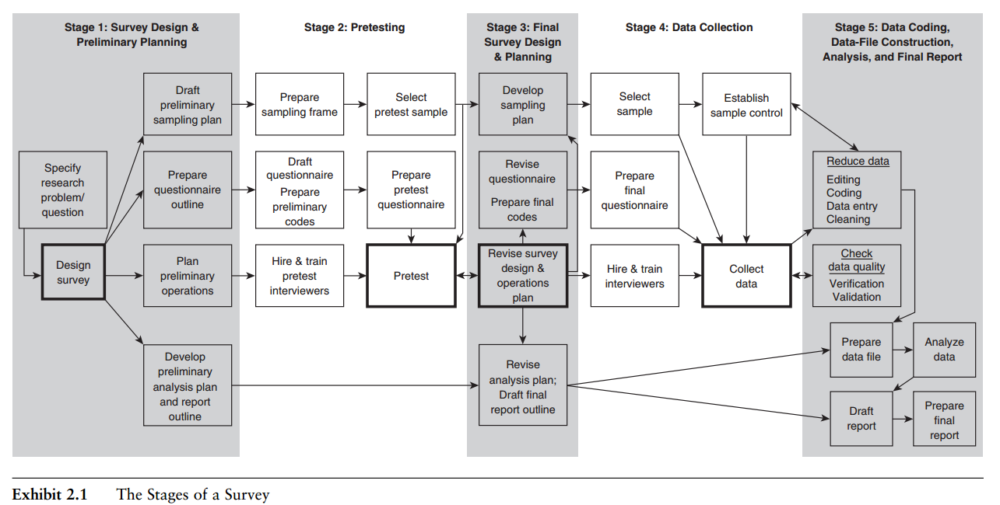

class: front

```{r eval=FALSE, include=FALSE}
# Correr esto para que funcione el infinite moonreader, el root folder debe ser static para si dirigir solo "bajndo" en directorios hacia el bib y otros

xaringan::inf_mr('/static/docpres/02_bases/2mlmbases.Rmd')

o en RStudio:
  - abrir desde carpeta root del proyecto
  - Addins-> infinite moon reader
```


```{r setup, include=FALSE, cache = FALSE}
require("knitr")
options(htmltools.dir.version = FALSE)
pacman::p_load(RefManageR)
# bib <- ReadBib("../../bib/electivomultinivel.bib", check = FALSE)
opts_chunk$set(warning=FALSE,
             message=FALSE,
             echo=FALSE,
             cache = FALSE, fig.width=7, fig.height=5.2)
pacman::p_load(flipbookr, tidyverse)
```


```{r xaringanExtra, include=FALSE}
xaringanExtra::use_xaringan_extra(c("tile_view", "animate_css"))
xaringanExtra::use_scribble()
xaringanExtra::use_share_again()
xaringanExtra::style_share_again(
  share_buttons = "none", 
  )
```


<!---
Para correr en ATOM
- open terminal, abrir R (simplemente, R y enter)
- rmarkdown::render('static/docpres/07_interacciones/7interacciones.Rmd', 'xaringan::moon_reader')

About macros.js: permite escalar las imágenes como [scale 50%](path to image), hay si que grabar ese archivo js en el directorio.
--->


.pull-left[
# Encuestas Sociales
## Juan Carlos Castillo
## Sociología FACSO - UChile
## 2do Sem 2022 
## [.green[encuestas-sociales.netlify.com]](https://encuestas-sociales.netlify.com)
] 
    

.pull-right[
.right[
<br>
## .yellow[Sesión 2: Bases]


]
]

---

layout: true
class: animated, fadeIn

---

<div style='position: relative; padding-bottom: 56.25%; padding-top: 35px; height: 0; overflow: hidden;'><iframe sandbox='allow-scripts allow-same-origin allow-presentation' allowfullscreen='true' allowtransparency='true' frameborder='0' height='315' src='https://www.mentimeter.com/app/presentation/f437952dc31bfb5eeb0a68915b365412/fd3df8380700/embed' style='position: absolute; top: 0; left: 0; width: 100%; height: 100%;' width='420'></iframe></div>

---
class: inverse, bottom, right, animated, slideInRight

.pull-left-narrow[
# .red[Contenidos]
]

.pull-right-wide[
### Definiciones y distinciones
### Algo de historia
### Pasos
### Encuestas y error
### Ejemplos]

---
class: inverse, bottom, right, animated, slideInRight

.pull-left-narrow[
# .red[Contenidos]
]

.pull-right-wide[
### .yellow[Definiciones y distinciones]
### Algo de historia
### Pasos
### Encuestas y error
### Ejemplos]


---
class: center

# .content-box-red.large[.red[Encuestas]]

.pull-left[

<br>
# ¿Metodología o Cuestionario?
<br>
]

.pull-right[
.center[


]
]
---
## Definiciones (Fowler, 2013 )

.medium[
1- El propósito de la .blue[encuesta] es .large[.red[producir estadísticas]], es decir, descripciones cuantitativas o numéricas sobre algunos aspectos de la población de estudio.
]

--

.medium[
2- La principal forma de recopilar información es .large[.red[haciendo preguntas]] a las personas; sus respuestas constituyen los datos a analizar.
]
--

.medium[
3- Por lo general, la información se recopila solo sobre una .large.red[fracción de la población], es decir, una muestra, en lugar de cada miembro de la población.
]
---
# Definciones: Encuesta (Lepkowski, 2009):

Una “encuesta” es un **método sistemático** para recopilar información de (una **muestra de**) entidades con el propósito de construir  **descriptores cuantitativos** de los atributos de la población más grande de la cual las entidades sonmiembros 

--

.medium[
- La palabra **sistemática** es deliberada y distingue significativamente las encuestas de otras formas de recopilar información. 

- La frase **una muestra de** aparece en la definición porque a veces las encuestas intentar medir a todos en una población y, a veces, solo a una muestra.]

---
# Definiciones: Metodología de encuestas 

.right[
.large[
La .red[metodología de encuestas] busca identificar principios sobre el **diseño**, la **recopilación**, el **procesamiento** y el **análisis** de las encuestas que están vinculados su costo y a su calidad] 
]

(Lepowski et al 2009)

---
# Algunas distinciones relevantes


.pull-left[
- Caracterización vs opinión

- Encuestas sociales (interés público) vs encuestas con fines particulares (ej: encuesta de satisfacción)

- Subnacionales, nacionales e internacionales]

.pull-right[

- Representativas vs no representativas

- Modo de aplicación: CATI, PAPI, etc
]

---
# Algunas distinciones relevantes

.pull-left[
- crosseccional/transveral vs panel/longitudinal

- personas / hogares / otras unidades de análisis

- encuestas vs pruebas de logro (ej: educación)
]

.pull-right[
- científicas vs políticas

- foco vs miscelaneas

- (datos) primarios vs secundarios
]

---
class: inverse

## .red[Recapitulando (1)] 

.pull-left[
### Aspectos centrales de una encuesta:
]
 
.pull-right[

.content-box-gray[
.red[
1. Preguntas y registro de respuestas
  
2. Muestra
  
3. Resultados cuantitativos (que sean representativos de la población)
]]]


---
class: inverse, bottom, right, animated, slideInRight

.pull-left-narrow[
# .red[Contenidos]
]

.pull-right-wide[
### Definiciones y distinciones
### .yellow[Algo de historia]
### Pasos
### Encuestas y error
### Ejemplos]


---
# Algunos hitos

- **1912** Primera encuesta de **Arthur Lyon Bowley** (LSE) sobre condiciones de vida en Londres 

  -  muesta de ciudadanos
  - cuestionario estructurado 

- El artículo seminal de **Neyman (1934)** estableció las bases para el muestreo teoría en su forma moderna

---
# Algunos hitos

- **Roper & Gallup** 

  - **1935**: Fortnue survey sobre 2da guerra mundial 
  
  - **1936**: pronóstico presidencial supera a suscriptores del Literary Digest, con N más pequeño pero más representativo

---
# Algunos hitos

- 1940: **Lazarfeld** y primera encuesta panel estudiando comportamiento de voto analizando con métodos multivariados

- 1940: Office of Public Opinion Research at Princeton University

- 1941: NORC (National Opinion Research Center)

- 1947 se funda AAPOR y WAPOR, y las encuestas se comienzan a enseñar en universidades de EEUU


---
# Algunos hitos

- 1949: Stouffer publica The American Soldier, basado en encuestas a más de 500 mil soldados

--

- 1960s: ICPSR (Inter-University Consortium for Political and Social Research) se desarrolla en Michigan

--

- 1980s -> 
  - reducción de costos de encuestas
  - disminución de tasas de respuestas
  - innovación en modos de aplicación
  - refinamiento en preguntas y aplicación

---
class: inverse, bottom, right, animated, slideInRight

.pull-left-narrow[
# .red[Contenidos]
]

.pull-right-wide[
### Definiciones y distinciones
### Algo de historia
### .yellow[Pasos]
### Encuestas y error
### Ejemplos
]


---


.tiny[(Czaja & Blair, 2005)]

---
class: middle


.pull-left[
<br>
<br>
# Flujo de encuestas

]

.pull-right[
]
---


---
class: inverse

## .red[Recapitulando (2)] 

.pull-left[
### Etapas de una encuesta:
]
 
.pull-right[

.content-box-gray[
.red[
1. Planificación y diseño
  
2. Pretest

3. Ajuste y diseño final

4. Recolección de datos
  
5. Publicación de archivos técnicos y resultados
]]]

---
class: inverse, bottom, right, animated, slideInRight

.pull-left-narrow[
# .red[Contenidos]
]

.pull-right-wide[
### Definiciones y distinciones
### Algo de historia
### Pasos
### .yellow[Encuestas y error]
### Ejemplos]


---
class: center


---
.pull-left-narrow[

<br>
<br>
# Error total de medición
<br><br>
RatSWD (2015)
]

.pull-right-wide[
]


---
class: inverse, bottom, right, animated, slideInRight

.pull-left-narrow[
# .red[Contenidos]
]

.pull-right-wide[
### Definiciones y distinciones
### Algo de historia
### Pasos
### Encuestas y error
### .yellow[Ejemplos]
]


---
# Algunas instituciones internacionales

- [Roper Center](https://ropercenter.cornell.edu/)

- [ICPSR](https://www.icpsr.umich.edu/web/pages/)

- [GESIS](https://www.gesis.org/en/home)

- [ESRA](https://esraeurope.org/)

---
# Ejemplos de encuestas actuales - Nacional

<br>
.pull-left[
.content-box-gray[
- [Encuestas CEP](https://www.cepchile.cl/encuestaCEP)

- [CASEN](http://observatorio.ministeriodesarrollosocial.gob.cl/encuesta-casen)

- [Encuestas INE](https://www.ine.cl/)]
]

.pull-right[
.content-box-red[
- [ENUT](https://www.ine.cl/estadisticas/sociales/genero/uso-del-tiempo)

- [Estudios PNUD](https://www.estudiospnud.cl/)

- [ELSOC]()
]]

---
# Ejemplo encuestas internacionales

.pull-left[
## Nacionales
.content-box-yellow[

- [GSS](https://gss.norc.org/)

- [SOEP](https://www.diw.de/en/diw_01.c.615551.en/research_infrastructure__socio-economic_panel__soep.html)

- [British Social Attitudes](https://www.bsa.natcen.ac.uk/)]]

.pull-right[
## Comparativas
.content-box-blue[
- [World Values Survey](https://www.worldvaluessurvey.org/wvs.jsp)

- [ISSP](https://issp.org/)

- [ESS](https://www.europeansocialsurvey.org/)

- [LAPOP](https://www.vanderbilt.edu/lapop/index.php/)

- [Latinobarómetro](https://www.latinobarometro.org/lat.jsp)
]]

---
class: inverse

## .red[RESUMEN]

- encuestas: cuestionario, muestra, datos

- historia reciente, desarrollo vertiginoso

- Diseño - pretest - campo - depuración - reporte

- Error total de encuestas: medición + representación 

---
class: roja

## Prox clase: 
Seleccionar encuesta / centro de estudios de encuestas en algún tema de interés y hacer ficha con la siguiente información: 

- Nombre
- Historia
- Objetivos
- Características
- Áreas de trabajo
- Proyectos emblemáticos

(para no repetirse, anotarse [AQUI](https://docs.google.com/spreadsheets/d/1fmaQeupmnE0kJYr-ET0nj4IsWJADDz99dAg7wLGjB78/edit#gid=0))
 


---
class: front

.pull-left[
# Encuestas Sociales
## Juan Carlos Castillo
## Sociología FACSO - UChile
## 2do Sem 2022 
## [.green[encuestas-sociales.netlify.com]](https://encuestas-sociales.netlify.com)
] 
    

.pull-right[
.right[
<br>


]

]


