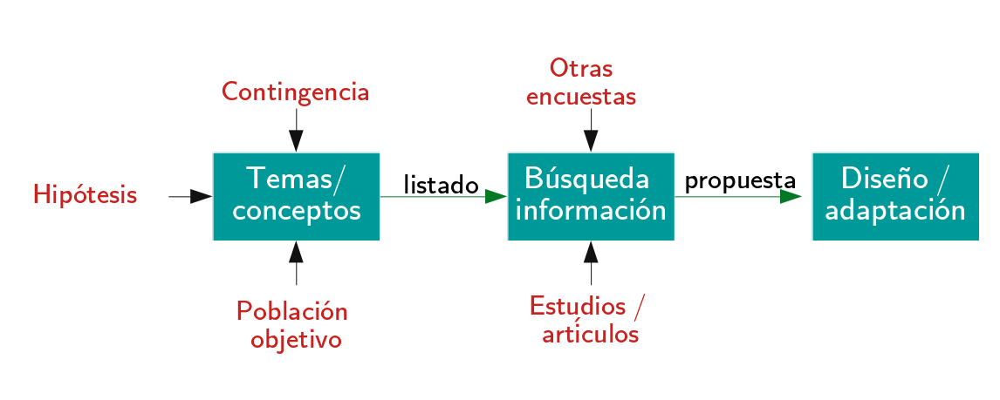

class: front

```{r eval=FALSE, include=FALSE}
# Correr esto para que funcione el infinite moonreader, el root folder debe ser static para si dirigir solo "bajndo" en directorios hacia el bib y otros

xaringan::inf_mr('/static/docpres/02_bases/2mlmbases.Rmd')

o en RStudio:
  - abrir desde carpeta root del proyecto
  - Addins-> infinite moon reader
```


```{r setup, include=FALSE, cache = FALSE}
require("knitr")
options(htmltools.dir.version = FALSE)
pacman::p_load(RefManageR)
# bib <- ReadBib("../../bib/electivomultinivel.bib", check = FALSE)
opts_chunk$set(warning=FALSE,
             message=FALSE,
             echo=FALSE,
             cache = FALSE, fig.width=7, fig.height=5.2)
pacman::p_load(flipbookr, tidyverse)


```


```{r xaringanExtra, include=FALSE}
xaringanExtra::use_xaringan_extra(c("tile_view", "animate_css"))
xaringanExtra::use_scribble()
xaringanExtra::use_share_again()
xaringanExtra::style_share_again(
  share_buttons = "none",
  )
```

<!---
Para correr en ATOM
- open terminal, abrir R (simplemente, R y enter)
- rmarkdown::render('static/docpres/07_interacciones/7interacciones.Rmd', 'xaringan::moon_reader')

About macros.js: permite escalar las imágenes como [scale 50%](path to image), hay si que grabar ese archivo js en el directorio.
--->


.pull-left[
# Encuestas Sociales
## Juan Carlos Castillo
## Sociología FACSO - UChile
## 2do Sem 2022
## [.green[encuestas-sociales.netlify.com]](https://encuestas-sociales.netlify.com)
]


.pull-right[
.right[
<br>
## .yellow[Sesión 5: Cuestionario]


]
]

---

layout: true
class: animated, fadeIn

---
class: inverse

## .red[Sesión anterior]

.pull-left[
### Preguntas:
]

.pull-right[

.content-box-gray[
.red[
1. Contexto del estudio influye en la construcción de preguntas

2. Tipos de preguntas

3. Precisando las preguntas (ej: calificativos)

]]]


---



---
class: roja
# Esta clase: Cuestionarios
---
# Estructura

- presentación

- consentimiento informado (aprobado por comité de ética)

- preguntas

- cierre

---
class: middle

## [Ejemplo consentimiento informado](../../files/docs/ejemploconsentimiento.pdf)


---
# Preguntas

- graduar energía cognitiva, comenzar y terminar con preguntas más fáciles/menos amenazantes

- comenzar con preguntas más interesantes para capturar antención y motivación

- variar preguntas según modo de respuesta para evitar monotonía

- decidir sobre si aleatorizar preguntas / módulos 

---
# Diseño del cuestionario

- en general se implementa en plataformas web

-> ir a [tutorial de formr](/resource/03-resource.html)


---
class: front

.pull-left[
# Encuestas Sociales
## Juan Carlos Castillo
## Sociología FACSO - UChile
## 2do Sem 2022
## [.green[encuestas-sociales.netlify.com]](https://encuestas-sociales.netlify.com)
]


.pull-right[
.right[
<br>


]

]
