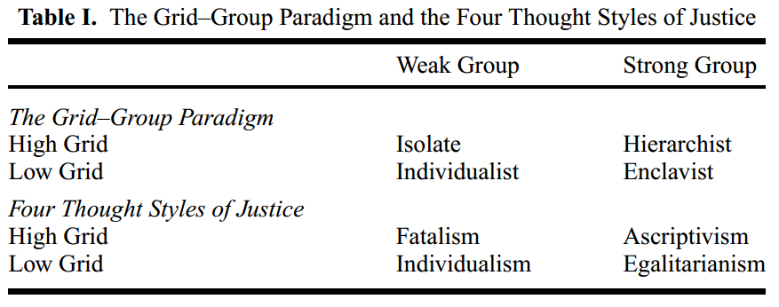
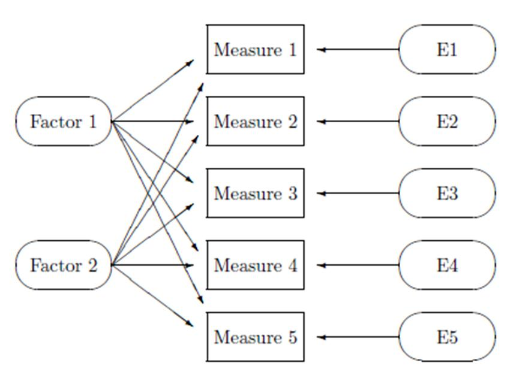
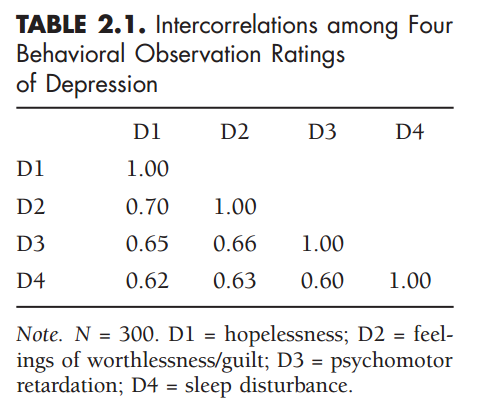
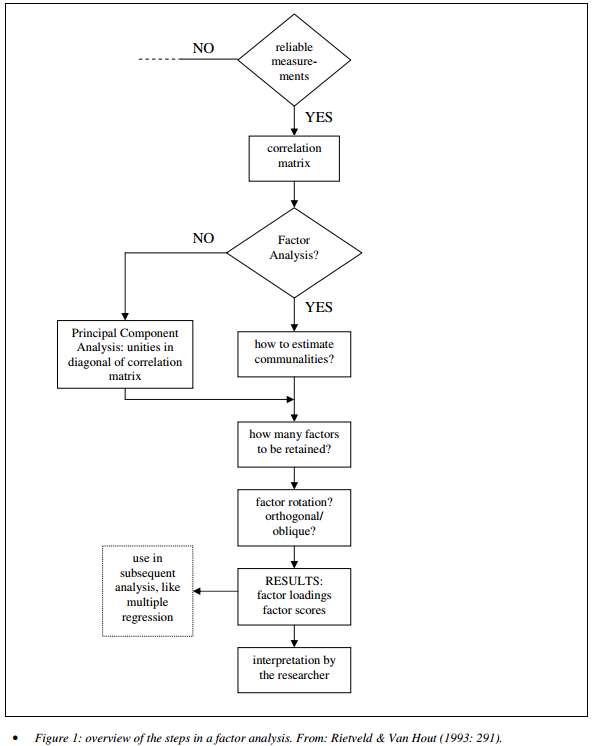
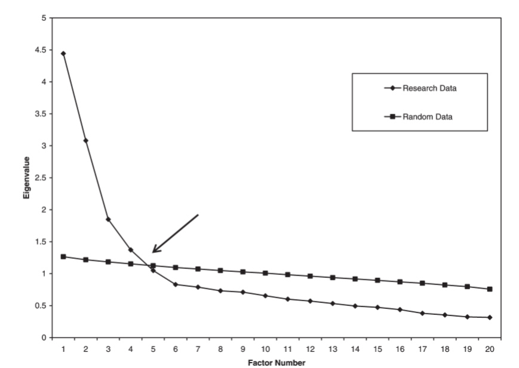
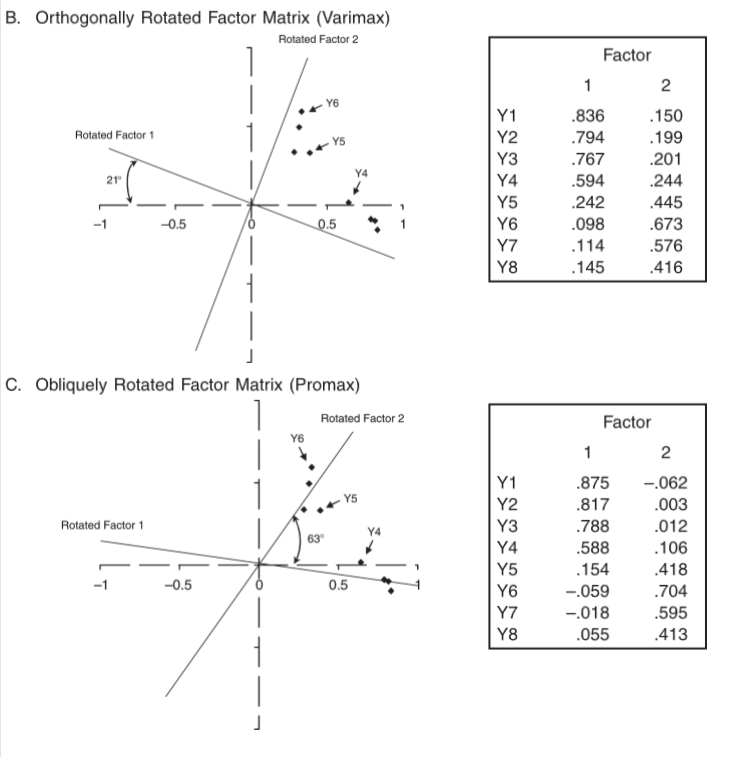

class: front
 
```{r eval=FALSE, include=FALSE}
# Correr esto para que funcione el infinite moonreader, el root folder debe ser static para si dirigir solo "bajndo" en directorios hacia el bib y otros

xaringan::inf_mr('/static/docpres/02_bases/2mlmbases.Rmd')

o en RStudio:
  - abrir desde carpeta root del proyecto
  - Addins-> infinite moon reader
```


```{r setup, include=FALSE, cache = FALSE}
require("knitr")
options(htmltools.dir.version = FALSE)
pacman::p_load(RefManageR)
# bib <- ReadBib("../../bib/electivomultinivel.bib", check = FALSE)
opts_chunk$set(warning=FALSE,
             message=FALSE,
             echo=FALSE,
             cache = FALSE, fig.width=7, fig.height=5.2)
pacman::p_load(flipbookr, tidyverse)


```


```{r xaringanExtra, include=FALSE}
xaringanExtra::use_xaringan_extra(c("tile_view", "animate_css"))
xaringanExtra::use_scribble()
#xaringanExtra::use_share_again()
#xaringanExtra::style_share_again(
#  share_buttons = "none",
#  )
```

<!---
Para correr en ATOM
- open terminal, abrir R (simplemente, R y enter)
- rmarkdown::render('static/docpres/07_interacciones/7interacciones.Rmd', 'xaringan::moon_reader')

About macros.js: permite escalar las imágenes como [scale 50%](path to image), hay si que grabar ese archivo js en el directorio.
--->


.pull-left[
# Encuestas Sociales
## Juan Carlos Castillo
## Sociología FACSO - UChile
## 2do Sem 2022
## [.green[encuestas-sociales.netlify.com]](https://encuestas-sociales.netlify.com)
]


.pull-right[
.right[
<br>
## .yellow[Sesión 8: Análisis factorial]


]
]

---

layout: true
class: animated, fadeIn

---
class: inverse
# Contenidos


---
### Objetivos de la sesión

-   Problematizar los supuestos a la base de los instrumentos de
    medición en relación a variables latentes

-   Introducción al concepto y estimación de variables latentes mediante
    análisis factorial exploratorio

---

# Instrumentos y error de medición

---
# Error total de encuesta
.center[

]

(Groves et al, 2010, en RATSWD WP 245, 2015)


---
class: middle

.pull-left-narrow[
# Preguntas y error de medición (1)
]
.pull-right-wide[
.content-box-yellow[
-   Para medir hechos observables simples usualmente se utiliza **una
    pregunta** (ej: edad)

-   Fenómenos complejos se miden en general con más de una pregunta, con
    el objetivo de dar mejor cuenta del atributo (i.e. minimizar error
    de medición)
]]

---
class: middle

.pull-left-narrow[
# Preguntas y error de medición (2)
]

.pull-right-wide[
.content-box-red[
-   En este marco se asume que el **indicador es distinto del atributo**, y que la medición del atributo o variable latente conlleva error

-   Cuando la el atributo se mide con más de una pregunta, se puede
    estimar la variable latente o factor mediante técnicas de **análisis
    factorial**
]]


---
## Ejemplo (Wegener & Liebig 2000)


.center[
  
]


---
## Ejemplo (Wegener & Liebig 2000)

.center[
  
]

---
class: middle

.pull-left-narrow[
#  Variables latentes (1)
]
.pull-right-wide[

-   La mayor parte de las variables en el mundo social no son
    directamente observables. Esto las hace constructos hipotéticos
    "latentes"

-   La medición de variables latentes se realiza a partir de indicadores
    observables, tales como ítems de un cuestionario
]

---
class: middle

.pull-left-narrow[
#  Variables latentes (2)
]
.pull-right-wide[
-   Lo latente puede ser entendido como la varianza compartida por
    diferentes indicadores observados

-   La medición de variables latentes se encuentra asociada al modelo de
    factor común (Thurstone) y al análisis factorial
]

---
# Factor común

.pull-left[
-   Cada indicador en un set de medidas observadas es una función lineal
    de uno o más factores comunes y un factor único

-   Como referencia podemos usar la teoría clásica de test (CTT), que
    divide el puntaje de los indicadores entre puntaje verdadero y error
    ]

--

.pull-right[
<br>
$$X=T+E$$

$$\sigma^{2}_{x}=\sigma^{2}_{t} + \sigma^{2}_{e}$$

Donde 
- X= puntaje observado, 
- T= puntaje verdadero, y 
- E= error

]
---
# Modelo de factor común

.pull-left[
-   La existencia de un solo ítem por constructo no permite aislar puntaje verdadero del error

-   Si existen más ítems, el **análisis factorial** y
    distinguir entre **varianza común** (compartida con otros indicadores) y **varianza única** (o error)
]

.pull-right[
.center[
  
]
]
---
# Análisis factorial

-   El análisis factorial es un conjunto de métodos para explicar las
    correlaciones entre variables en términos de entidades más generales
    llamadas variables latentes o factores

-   El o los factores darían cuenta (i.e. causarían) de la covariación
    entre una serie de medidas observadas (indicadores)

---
# Análisis factorial

-   Un factor es una variable no observada que da cuenta de las
    correlaciones entre indicadores = los indicadores están
    correlacionados porque comparten una causa común (*independencia
    condicional*)


-   Es un intento de comprensión más parsimonioso que la correlación
    entre una serie de indicadores ya que el número de factores es menor
    que el de indicadores


---
# Objetivos del análisis factorial

-   Teórico: relacionar datos con dimensiones latentes basadas en
    conceptos (validez de constructo)

-   Pragmático: hacer sentido de un conjunto de datos, reducción de
    dimensiones y obtención de puntajes

-   Metodológico: aislar el error (varianza única) de la varianza común


---
# Alternativas en análisis factorial

-   exploratorio (EFA): Permite explorar las dimensiones que subyacen a
    una escala

-   confirmatorio (CFA): Permite confirmar las dimensiones que subyacen
    a una escala, aislando el error de medición en la estimación

---
# Análisis factorial exploratorio (EFA)

-   Forma de análisis factorial donde se estiman la o las variables
    latentes a un conjunto de indicadores, sin una especificación previa
    de la estructura factorial.

-   Preguntas a responder:

    -   ¿Cuántos factores subyacen a un conjunto de indicadores?

    -   ¿Cómo se relacionan los indicadores con los factores?

    -   ¿Cómo es la calidad del modelo estimado?


---
### Características EFA

-   Basado en la matriz de correlaciones

-   Diferentes métodos de extracción de factores

-   Determinación del número y "calidad" de las dimensiones (continuas)
    subyacentes a una escala

-   Dimensiones continuas latentes: factores

-   Variables observadas: indicadores


---
### Bases correlación

-   varianza 
$$\sigma^2 = \frac{\sum_{i=1}^{n}(x_i - \bar{x})^2} {n-1}=\frac{\sum_{i=1}^{n}(x_i - \bar{x})(x_i - \bar{x})} {n-1}$$

-   covarianza 
$$cov(x,y) = \frac{\sum_{i=1}^{n}(x_i - \bar{x})(y_i - \bar{y})} {n-1}$$
---
# Correlación

$$r= \frac{\sum_{i=1}^{n}(x_i - \bar{x})(y_i - \bar{y})} {(n-1)\sigma_x \sigma_y }$$


- medida estandarizada de asociación entre variables continuas

- varía entre -1 y 1

- mientras más cercana a |1|, mayor es la correlación entre dos variables


---
# Matriz de correlaciones

.center[
  

Matriz hipotética de variables que miden un constructo

]


---
# Ej. Matriz de correlaciones (1)

.center[
  

Matriz hipotética de variables que miden constructos independientes
] 

---
# Ej. Matriz de correlaciones (2)

.center[
  

Matriz hipotética de variables que miden un constructo

]

---
# Ej. Matriz de correlaciones (3)

.center[
  

Matriz hipotética de variables que miden dos constructos independientes] 


---
### Ejemplo Brown 2006 (Chap.2)

.center[



]

---
## Ejemplo Brown 2006 (Chap.2)

.center[


]

---
## Ejemplo Brown 2006 (Chap.2)

.center[


]


---
### Ecuaciones fundamentales

$$y_{j}= \lambda_{j1} \eta_{1} + \lambda_{j2} \eta_{2} + ... + \lambda_{jm} \eta_{m} + \varepsilon_{j}$$

Donde

-   $\eta$: factor

-   $\lambda_{jm}$ representa la carga factorial que relaciona al
    indicador *j* con el factor $\eta$

-   $\varepsilon_{j}$ representa la varianza que es única al indicador
    $y_{j}$


---

... aplicado al ejemplo de Brown 2006:

- $D1=\lambda_{11}\eta_{1} + \varepsilon_{1}$
- $D2=\lambda_{21}\eta_{1} + \varepsilon_{2}$
- $D3=\lambda_{31}\eta_{1} + \varepsilon_{3}$
- $D4=\lambda_{41}\eta_{1} + \varepsilon_{4}$


---
# Aplicado al ejemplo de Brown 2006:

Reproduccion de matriz de correlaciones a patir de los parámetros del
modelo. Ejemplo Brown 2006 cap. 2:

-   VAR(D1)= $\sigma_{11}=\lambda_{11}\psi_{11} + \varepsilon_{1}=.83^{2}(1) + .31 = 1.00$

-   COV(D1,D2)= $\sigma_{21}=\lambda_{11}\psi_{11}\lambda_{21}=(.83)(1)(.84) =.70$

---
# Conceptos y parámetros

-   **Factores**: variables latentes que están a la base de las
    correlaciones entre los indicadores

-   **Cargas factoriales**: medida estandarizada de asociación (correlación) entre el indicador y la variable latente

-   **Comunalidad**: proporción del indicador que se asocia a factor(es)
    comun(es)

---
# Conceptos y parámetros (2)

-   **Varianza única** (uniqueness): 1-comunalidad

-   **Eigenvalues**: medida de proporción de la varianza total
    correspondiente a cada uno de los factor (SS loadings)

-   **Proporción de varianza** explicada por el factor = eigenvalue /
    número de indicadores

---
### Pasos en el análisis

-   Estimación de matriz de correlaciones

-   Extraccion de factores

-   Decisión sobre número de factores

-   Rotación

-   Interpretación y reporte

-   Obtención de puntajes factoriales

---

.center[
  
]

---
## Supuestos a evaluar

-   Nivel de medición de variables, normalidad

-   Normalidad multivariada (test de normalidad multivariado, ej: Shapiro
    Wilk multivariado)

-   Adecuación muestal (KMO)
.medium[
      - varía entre 0 y 1, contrasta si las correlaciones parciales entre las variables son pequeñas.
      
- valores pequeños (menores a 0.5) indican que los datos no serían adecuados para EFA, ya que las correlaciones entre pares de variables no pueden ser explicadas por otras variables
]

---
## Supuestos a evaluar (2)

-   Nivel de correlaciones de la matriz: test de esfericidad de Bartlett

    -   se utiliza para evaluar la hipótesis que la matriz de
        correlaciones es una matriz identidad (diagonal 1 y bajo la
        diagonal 0)

    -   se busca significación (p $<$ 0.05)ya que se espera que las
        variables estén correlacionadas


---
### Metodos de extracción

-   Factores principales

-   Factores principales iterados: estima comunalidades iterativamente,
    reemplazandolas en la matriz de correlaciones a partir de las
    comunalidades estimadas desde los factor loadings

-   Maximum likelihood: maximiza la posibilidad de que los parametros reproduzcan los datos observados
---
# Instrumentos y criterios de selección del número de factores

-   Criterio de Kaiser: eigenvalues mayores a 1

-   Scree plot (gráfico de sedimentación)

-   Análisis paralelo: comparación de eigenvalues de la muestra con
    eigenvalues de datos aleatorios. Nº apropiado de factores: numero de
    eigenvalues de los datos reales que son mayores que sus
    correspondientes eigenvalues de datos aleatorios

---
## Screeplot y análisis paralelo

.center[
  
]

---
## Tipos de rotación

-   Ortogonal: asume que los factores no se encuentran correlacionados

-   Oblicua: permite correlación entre factores

.center[
  
]


---
### Reporte

 {.scriptsize}
 {.center}
 {.tabular}
l r r r r r Variable & ML2 & ML1 & h2 & u2 & com BIO & ** 0.86 & 0.01 &
0.75 & 0.25 & 1.00 GEO & ** 0.78 & 0.02 & 0.63 & 0.37 & 1.00 CHEM & **
0.88 & -0.07 & 0.75 & 0.25 & 1.01 ALG & -0.06 & ** 0.80 & 0.63 & 0.37 &
1.01 CALC & -0.02 & ** 0.98 & 0.95 & 0.05 & 1.00 STAT & 0.11 & ** 0.49 &
0.29 & 0.71 & 1.11 SS loadings & 2.14 & 1.84 & ML2 & 1.00 & 0.26 ML1 &
0.26 & 1.00************


[\[default\]]{#default label="default"}


